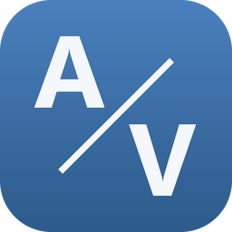
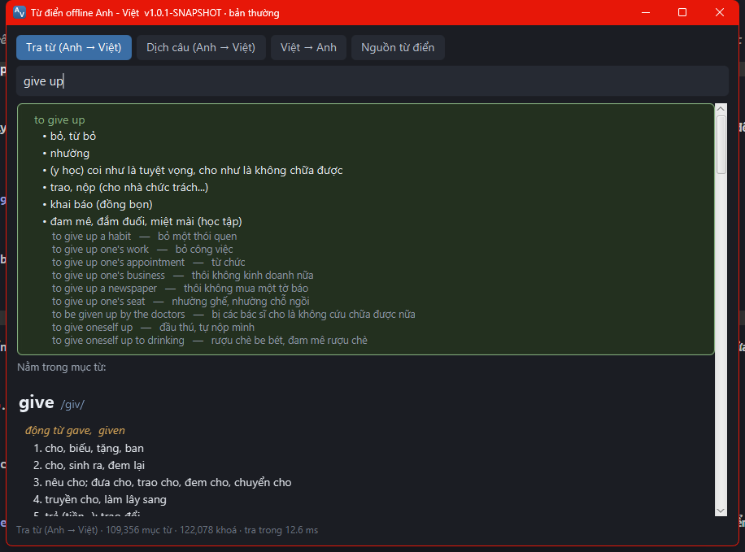
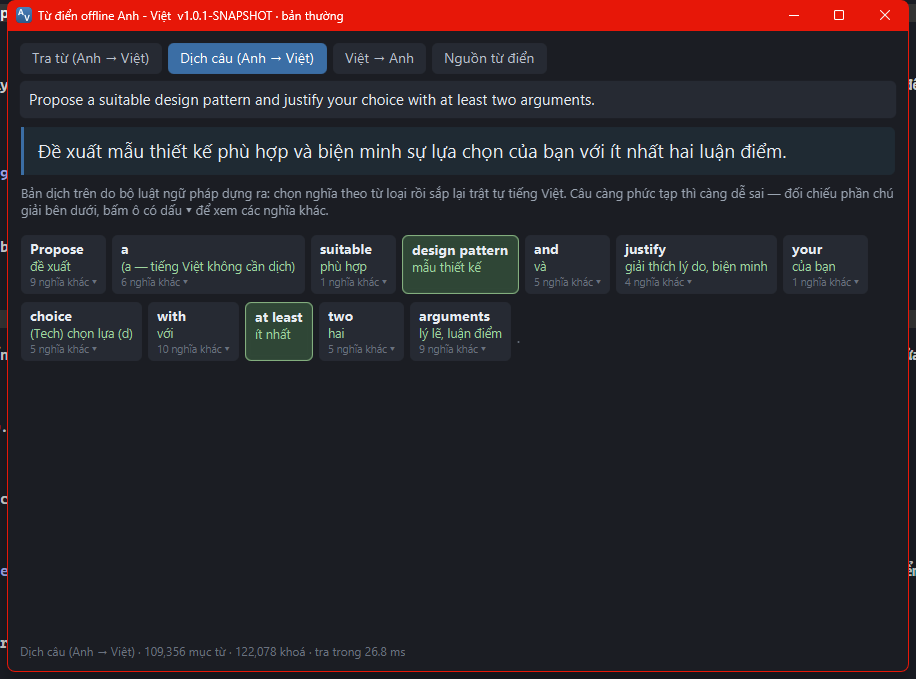
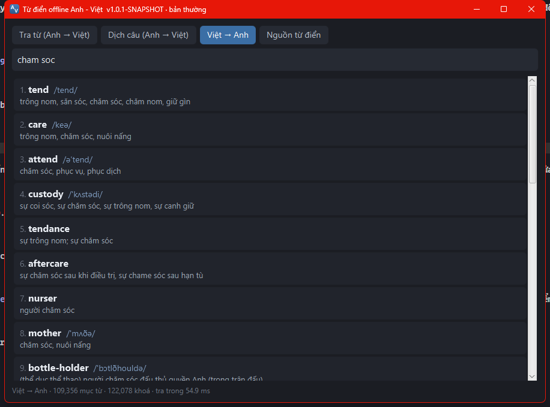

# Từ điển & dịch offline Anh–Việt

Tra từ và dịch câu tiếng Anh **không cần mạng**. Không tài khoản, không quảng cáo,
không gửi gì ra ngoài. Dành cho Windows 10/11.

<br clear="right">

## ⬇ Tải về

### [**▶ TẢI BẢN THƯỜNG — 46 MB**](https://github.com/AnhTuan2111/offline-translate-vi-en/releases/latest/download/TuDienOffline-1.0.1.msi)

Tra từ và dịch câu bằng từ điển và luật ngữ pháp. Nhẹ, mở nhanh.
**Hầu hết mọi người nên tải bản này.**

### [**▶ TẢI BẢN AI — 185 MB**](https://github.com/AnhTuan2111/offline-translate-vi-en/releases/latest/download/TuDienOffline-AI-1.0.1.msi)

Có thêm bộ dịch máy chạy ngay trên máy bạn, dịch câu dài và câu khó mượt hơn hẳn.
Nặng hơn, mỗi câu dịch lâu hơn khoảng nửa giây.

Cài được **cả hai cùng lúc** để so sánh — tên và màu icon khác nhau.

> ### ⚠ Đừng bấm nút `Code` màu xanh ở đầu trang
> Nút đó tải mã nguồn cho lập trình viên, **không có phần mềm bên trong**. Ở trang
> Releases cũng vậy: hai dòng `Source code (zip)` và `Source code (tar.gz)` là do GitHub
> tự thêm vào, bỏ qua chúng. Chỉ hai nút xanh ở trên mới là phần mềm.

Không muốn cài đặt gì cả? Có
[**bản chạy thẳng (45 MB)**](https://github.com/AnhTuan2111/offline-translate-vi-en/releases/latest/download/TuDienOffline-1.0.1-windows.zip)
— giải nén ra, bấm `TuDienOffline.exe` là dùng được. Xoá thư mục đi là sạch, không để lại gì.

---

## Phần mềm trông như thế nào



*Gõ `give up` — nghĩa của cả cụm hiện lên trước, kèm ví dụ.*



*Dán cả câu vào. Bên dưới câu dịch là chú giải từng cụm, bấm vào ô để đổi nghĩa khác.*

---

## Cài đặt

**1.** Bấm đúp vào file `.msi` vừa tải.

**2.** Trình duyệt có thể hỏi *"file này không an toàn"* → bấm **Giữ lại** / **Keep**.
Chuyện này xảy ra với mọi file cài đặt tải từ Internet.

**3.** Windows hiện bảng xanh **"Windows protected your PC"** → bấm dòng chữ nhỏ
**More info**, rồi bấm nút **Run anyway**.

Bảng đó hiện ra vì bộ cài chưa mua chữ ký số (khoảng 300 USD mỗi năm), **không phải vì
máy phát hiện virus**. Muốn tự kiểm tra cho yên tâm thì xem mục
[Kiểm tra file tải về](#kiểm-tra-file-tải-về).

**4.** Bấm **Next** vài lần là xong.

- Không cần cài Java hay bất cứ phần mềm nào khác.
- **Không cần quyền quản trị máy** — cài được trên máy trường, máy công ty.

**5.** Mở phần mềm bằng shortcut ngoài Desktop, hoặc gõ *tudien* vào ô tìm kiếm của Windows.

Muốn gỡ: **Settings → Apps → Installed apps**, tìm `TuDienOffline`, bấm **Uninstall**.
Gỡ sạch, không để lại gì.

---

## Hướng dẫn dùng

Có ba chế độ, bấm nút trên cùng để đổi.

### 1. Tra từ (Anh → Việt)

Gõ một từ hoặc một cụm rồi bấm Enter.

- Gõ cả cụm như `give up`, `look after`: nghĩa của **cụm** hiện lên trước, không phải ngồi
  mò giữa một mục từ dài mấy chục nghĩa.
- Gõ sai chính tả vẫn ra: gõ `aboout` nó hiểu là `about`.

### 2. Dịch câu (Anh → Việt)

Dán cả câu vào rồi Enter.

Dưới câu dịch có phần **chú giải từng cụm** — mỗi ô là một từ kèm nghĩa đã được chọn.
Ô nào có dấu `▾` là từ đó còn nghĩa khác; bấm vào ô để xem và chọn nghĩa hợp hơn.

Đây là chỗ hữu ích nhất khi gặp câu dài mà không chắc mình hiểu đúng.

### 3. Việt → Anh



Gõ tiếng Việt, ra danh sách từ tiếng Anh tương ứng, xếp theo mức sát nghĩa.
**Gõ không dấu cũng được**: `cham soc` ra đúng kết quả như `chăm sóc`.

### Phím tắt

| Phím | Việc |
|---|---|
| `Ctrl` + `1` / `2` / `3` | đổi giữa ba chế độ |
| `Ctrl` + `L` | nhảy về ô nhập, bôi đen sẵn để gõ đè |
| `Enter` | tra |

### Nút "Nguồn từ điển"

Phần mềm có sẵn ba bộ từ điển: bộ chung hơn 108.000 mục, bảng thuật ngữ công nghệ thông
tin, và bảng thuật ngữ y tế. Nút này cho **bật/tắt** từng bộ và **đổi thứ tự ưu tiên** —
bộ nào xếp trên thì nghĩa của nó được dùng trước.

Ví dụ đang đọc tài liệu kỹ thuật thì kéo bảng thuật ngữ CNTT lên trên: `platform` sẽ ra
*"nền tảng"* thay vì *"sân ga"*. Đổi xong có tác dụng ngay, không phải khởi động lại.

---

## Nên biết trước khi dùng

**Dịch câu không hoàn hảo.** Bản thường dịch sai câu bị động có mệnh đề quan hệ. Ví dụ
`restricts what each user is allowed to do` ra *"giới hạn gì mỗi người dùng là cho phép
để cho đến"* — đọc không hiểu gì. Câu kiểu đó cần bản AI.

Hãy coi phần dịch câu là **thứ giúp bạn hiểu câu gốc**, không phải bản dịch hoàn chỉnh để
nộp đi. Phần chú giải từng cụm bên dưới mới là chỗ đáng tin nhất.

**Không có phát âm.** Có phiên âm IPA dạng chữ, không có loa đọc.

**Không dịch được cả câu từ Việt sang Anh.** Chiều đó chỉ tra từ và cụm. Cố làm sẽ ra câu
sai mà người dùng không có cách nào biết.

---

## Kiểm tra file tải về

Muốn chắc file tải về đúng là file gốc, chưa bị ai sửa dọc đường: mở **PowerShell** tại
thư mục chứa file rồi gõ

```powershell
Get-FileHash .\TuDienOffline-1.0.1.msi -Algorithm SHA256
```

So chuỗi ký tự nhận được với file `SHA256SUMS.txt` ở
[trang tải](https://github.com/AnhTuan2111/offline-translate-vi-en/releases/latest).
Giống nhau nghĩa là file đúng.

---

## Hỏi đáp

**Có cần mạng không?** Không, kể cả lần chạy đầu tiên. Rút mạng ra vẫn dùng bình thường.

**Có gửi dữ liệu của tôi đi đâu không?** Không. Phần mềm không có một dòng mã nào mở kết
nối mạng.

**Máy yếu chạy được không?** Được. Tốn khoảng 150 MB RAM, mở lên mất chưa đến 2 giây.

**Máy không có quyền admin thì sao?** Vẫn cài được bình thường. Phần mềm cài vào thư mục
riêng của tài khoản bạn, không đụng vào hệ thống.

**Nên chọn bản nào?** Bản thường, trừ khi bạn hay phải đọc câu tiếng Anh dài và phức tạp.
Không chắc thì cài cả hai rồi so.

**Bản AI có gửi câu lên mạng không?** Không. Bộ dịch máy nằm luôn trong thư mục cài và
chạy trên máy bạn.

**Có bản cho macOS / Linux / điện thoại không?** Chưa có, hiện chỉ có Windows.

---

## Giấy phép

Phần mềm miễn phí, dùng cho mục đích cá nhân và học tập.

Bộ dịch máy dùng mô hình [opus-mt-en-vi](https://huggingface.co/Xenova/opus-mt-en-vi)
của Helsinki-NLP, giấy phép Apache-2.0.

Bộ từ điển chung lấy từ một tập dữ liệu Anh–Việt lưu hành trên mạng mà **chưa xác minh
được giấy phép**. Nếu bạn là người giữ bản quyền tập dữ liệu đó, mở một
[issue](https://github.com/AnhTuan2111/offline-translate-vi-en/issues) là sẽ được gỡ xuống.

---

*Lập trình viên muốn tự dựng từ mã nguồn: xem [PHAT-TRIEN.md](PHAT-TRIEN.md).*
