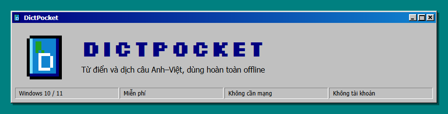
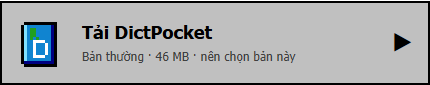
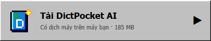
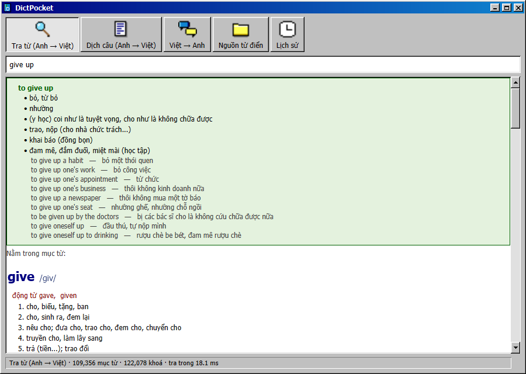
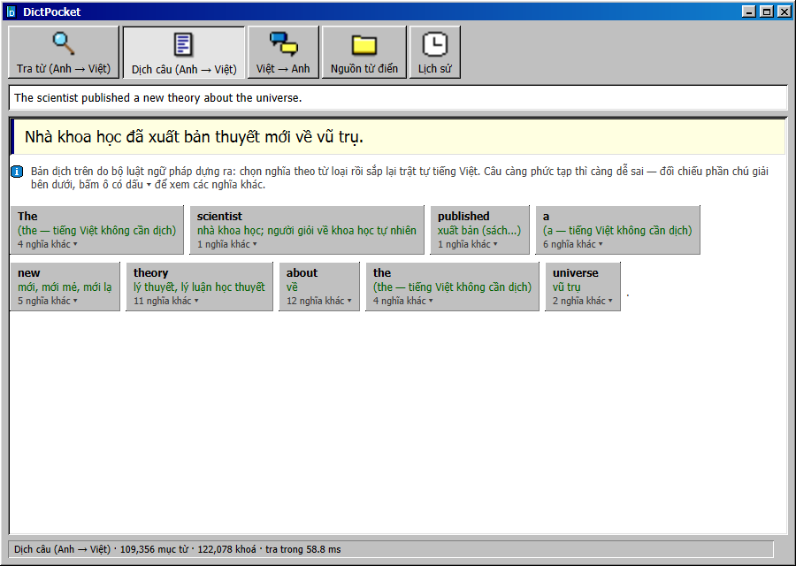
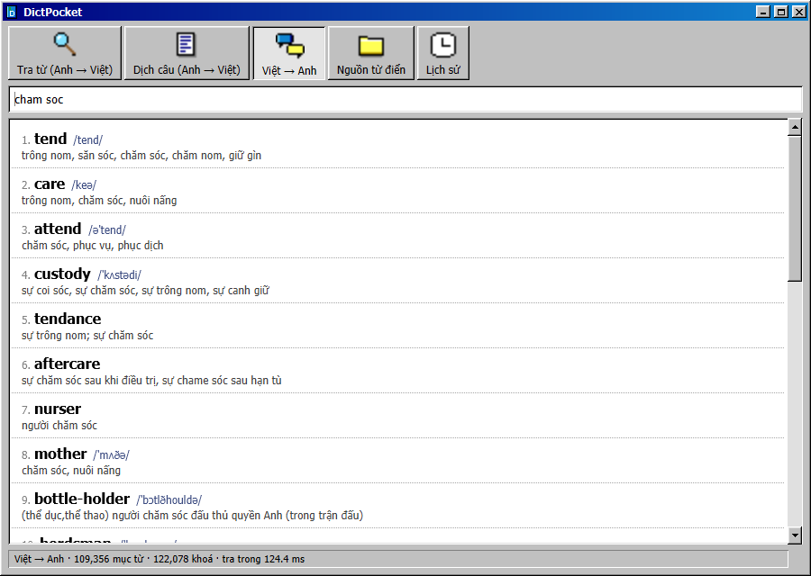
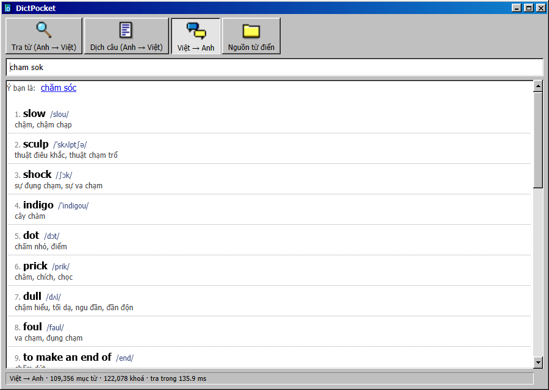

Hầu hết mọi người nên chọn <b>bản thường</b>. Bản <b>AI</b> thêm bộ dịch máy chạy ngay trên máy bạn, dịch câu dài mượt hơn nhưng lâu hơn nửa giây mỗi câu. 
Không muốn cài? <a href="https://github.com/AnhTuan2111/DictPocket/releases/latest/download/DictPocket-Portable.zip">Bản chạy thẳng (45 MB)</a>: giải nén rồi bấm <code>DictPocket.exe</code>.

> **Đừng bấm nút `Code` màu xanh** hay hai dòng `Source code` ở trang Releases: đó là mã nguồn, không có phần mềm.

<table>
  <tr>
    <td align="center"> Gõ <code>give up</code>: nghĩa của cả cụm hiện lên trước, kèm ví dụ</td>
    <td align="center"> Dịch cả câu, bên dưới là chú giải từng cụm, bấm ô để đổi nghĩa</td>
  </tr>
  <tr>
    <td align="center"> Việt → Anh: gõ không dấu <code>cham soc</code> vẫn ra đúng</td>
    <td align="center"> Gõ sai chính tả thì có dòng "Ý bạn là", bấm vào là tra luôn</td>
  </tr>
</table>

Bấm đúp file `.msi` vừa tải rồi bấm **Next** vài lần, không cần quyền quản trị. Nếu Windows hiện bảng xanh
**"Windows protected your PC"**, bấm **More info** rồi **Run anyway**. Mở bằng shortcut ngoài Desktop.

Bấm nút trên cùng để đổi chế độ, gõ vào ô rồi bấm Enter.

| Chế độ | Làm gì |
|---|---|
| **Tra từ** | Gõ một từ hoặc cụm như `give up`: nghĩa của cả cụm hiện lên trước. Gõ sai chính tả vẫn ra (`aboout` → `about`). |
| **Dịch câu** | Dán cả câu hoặc cả đoạn. Dưới bản dịch là chú giải từng cụm; ô nào có `▾` thì bấm vào để chọn nghĩa khác. Bản dịch giúp bạn hiểu câu gốc, hãy đối chiếu với phần chú giải. |
| **Việt → Anh** | Gõ tiếng Việt ra danh sách từ tiếng Anh. Gõ không dấu cũng được. |

- **Lịch sử**: bấm nút Lịch sử (hoặc `Ctrl`+`H`) để xem lại những gì đã tra. Gõ để lọc, bấm đúp để tra lại.
  Trong ô nhập, phím `↑` `↓` gọi lại câu đã tra.
- **Nguồn từ điển**: bật/tắt từng bộ từ điển và đổi thứ tự ưu tiên. Ví dụ đọc tài liệu kỹ thuật thì kéo
  "Thuật ngữ CNTT" lên trên: `platform` ra *nền tảng* thay vì *sân ga*.
- Phím tắt: `Ctrl`+`1` / `2` / `3` đổi chế độ, `Ctrl`+`L` về ô nhập.
